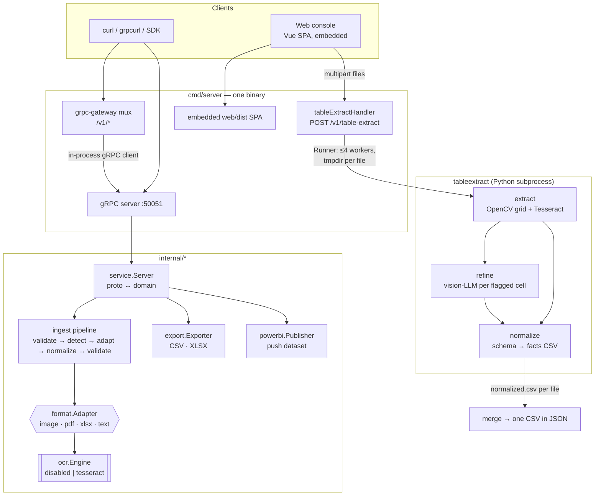

# How it works

This doc walks through what happens under the hood for each request — from the
listener sockets down to the OCR word level — and where each decision is made.
Package-level detail lives in [architecture.md](architecture.md) and
[extraction.md](extraction.md); this is the end-to-end story.

## Two lanes into the service

The server (`cmd/server`) opens two listeners: a gRPC server on `SERVER_PORT`
(50051) and an HTTP server on `HTTP_PORT` (8080). The HTTP server multiplexes
three kinds of traffic:

- `/v1/*` — the grpc-gateway REST proxy, which dials back into the gRPC server
- `POST /v1/table-extract` — a plain multipart endpoint served directly by the
  Go process, bypassing gRPC entirely
- `/` — the embedded web console (Vue build from `web/dist`, with the static
  `a hint message` when absent) and `/healthz`



## Lane 1 — `ExtractDocument` (any format)

`service.Server.ExtractDocument` receives a `DocumentInput` (name + raw bytes,
base64 over JSON) plus `ExtractOptions`, then hands it to `ingest.Pipeline`:

1. **Validate the request** — non-empty content, under `MAX_DOCUMENT_BYTES`.
2. **Detect format** — magic-byte sniffing first; if nothing matches, tabular
   text detection (JSON array → markdown table → CSV fallback).
3. **Dispatch to the adapter** registered for that format. The pipeline never
   sees format internals.
4. **Per-page extraction** — each adapter emits `Page`s:
   - *image*: decode → metadata; OCR via `ocr.Engine` only when `options.ocr`
   - *pdf*: native text layer per page; scanned pages go to the OCR engine
   - *xlsx*: cells read directly — no OCR involved
   - *text*: delegated to `parser.Service` (csv / json / markdown extractors)
5. **Normalize** — every extracted grid runs through `parser.NormalizeTable`:
   typed columns, typed `Value`s, parse warnings.
6. **Validate the `Document`** — structural invariants, `MAX_DOCUMENT_PAGES` cap.

Errors are **per-page, not per-request**: a page that can't be decoded carries
`Page.Err` with a code (`OCR_UNAVAILABLE`, `OCR_FAILED`, `PAGE_UNREADABLE`)
while sibling pages still succeed.

`ParseDocument`, `ExportCSV`, `ExportXLSX` and `PublishToPowerBI` reuse the same
pieces: `ParsedDocument` *is* a typed table, so exporters and the Power BI
publisher work on either a fresh `DocumentInput` or a previously returned
`ParsedDocument` (the `DataSource` oneof) — parse once, fan out to many sinks.

## Lane 2 — `POST /v1/table-extract` (scanned ruled tables)

This endpoint exists because scanned balance-sheet-style tables need a
different pipeline than generic OCR: grid geometry first, cell-level OCR
second, optional LLM cleanup third. `internal/textract.Runner` orchestrates it
by shelling out to the `tableextract` Python package:

```
python -m tableextract extract <tmpdir>/out      # always
python -m tableextract refine  <tmpdir>/out           # when refine=true
python -m tableextract normalize <tmpdir>/out         # always
```

Concurrency and isolation:

- Up to **4 files** processed concurrently (`Runner.Workers`), each in its own
  temp dir that is removed afterwards
- **3-minute timeout** per file, quadrupled when `refine` is on (LLM calls are
  slow); override with `TABLEEXTRACT_TIMEOUT`
- A failed file becomes a `FileStatus.error` in the response — it does not fail
  the batch
- Interpreter resolution: `TABLEEXTRACT_PYTHON` (default `python3`), working
  dir `TABLEEXTRACT_DIR` (default `tableextract`, skipped when pip-installed)

### `extract` — pixels to cells

1. Decode with OpenCV; upscale 2× when narrower than 1400px.
2. Deskew + adaptive Gaussian threshold → binary image.
3. Grid detection: morphological open with long horizontal/vertical kernels
   finds ruled lines (`grid.grid_lines`). If no ruled columns are found, fall
   back to *borderless* mode — horizontal ink projection for rows, whitespace
   gaps for columns.
4. Whole-page Tesseract word OCR (`pytesseract`, `Output.DATAFRAME`), then each
   word is binned into the cell containing it (`ocr.bin_words`).
5. Numeric-column detection (`ocr.numeric_columns`) decides which columns
   should read as numbers.
6. Second pass: cells under `CONF_RETRY` (65) in populated rows — and empty
   cells in numeric columns — are re-OCR'd per-cell with a digit whitelist.
7. Emit `pages.csv`, `tables.csv`, `crops.csv` + a `crops/` PNG per cell under
   `CONF_FLAG` (70).

### `refine` — vision-LLM cell repair (optional)

For every flagged crop, sends the PNG to an OpenAI-compatible vision endpoint
(NVIDIA NIM by default: fast model for plain cells, 90b for stubborn ones),
then `normalize_reply` unwraps chatty answers ("the number is X", quoted
strings, meta sentences) back into bare cell values. Output:
`tables_refined.csv` + `refine_log.csv` (old → new per cell, model used).
Requires `NVIDIA_API_KEY` / `LLM_API_KEY`; skipped entirely without one.

### `normalize` — grid rows to facts

Reads `tables_refined.csv` (or `tables.csv` when refine didn't run) and emits
`normalized.csv` — one row per numeric cell:

```
file, row, section, line_item, period, value, raw, flag
```

- `section` — nearest heading-ish row above (assets, liabilities, …)
- `line_item` — first non-numeric label in the row
- `period` — parsed from the sheet's date header (Standalone/Consolidated ×
  year); positional labels (`col4`, `col5`, …) when no header is found
- `flag` — low-confidence cells survive, marked for human review

The Go side merges every file's `normalized.csv` into a single CSV and returns
`{csv, rows, flagged, files[]}` as JSON.

## Replaceable seams

| Seam | Contract | Swap point |
|---|---|---|
| File format | `format.Adapter` | register in `ingest.New` |
| OCR engine | `ocr.Engine` | `-tags tesseract` build, or new impl |
| Export target | `export.Exporter` | `service` wiring |
| LLM provider | OpenAI-compatible HTTP | `URL`/`MODEL_*` in `refine.py` |

Each seam is deliberately boring: adding a format, engine, provider or
destination never changes the pipeline's shape.
